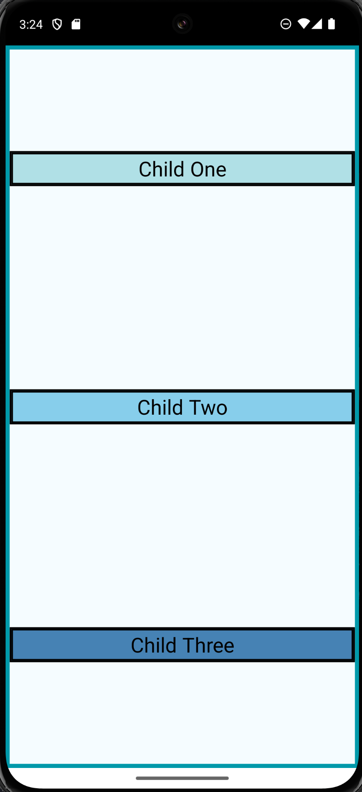

# 🌙 C346 Week03 Lesson07 (Exercise 3)

[](#)
[](#)
[](#)
[](#)

---

## 📝 Overview

Lessons 7 taught us on the fundamental layout style in React Native - Flexbox. We were taught on how we can manipulate the layout of child components by manipulating the parent's flex properties (e.g. flexDirection, justifyContent and alignItems).

> ✨ _Example:_ Arranging 3 view components horizontally or centralise it on a screen.

---

## 🎬 Demo / Media


<p align="center">
  

</p>

---

## 🚀 Features

- ✅ Inline Style & StyleSheet
- ✅ Flex Properties

---

## 💡 Key Concepts

| Concept            | Description                                                         |
| :----------------- | :------------------------------------------------------------------ |
| **FlexDirection**  | Contorls the direction in which the children of a node are laid out |
| **JustifyContent** | Aligns children in the main direction                               |
| **AlignItems**     | Align children along the cross axis of their container              |

---

## 🧱 Code Snippet

```jsx
/*************************************
             Exercise 3E
*************************************/
export default function App() {
  return (
    <View style={styles.Parent}>
      <View style={[styles.Child, { backgroundColor: "powderblue" }]}>
        <Text style={styles.Child}>Child One</Text>
      </View>
      <View style={[styles.Child, { backgroundColor: "skyblue" }]}>
        <Text style={styles.Child}>Child Two</Text>
      </View>
      <View style={[styles.Child, { backgroundColor: "steelblue" }]}>
        <Text style={styles.Child}>Child Three</Text>
      </View>
      <StatusBar barStyle="default" />
    </View>
  );
}
```
